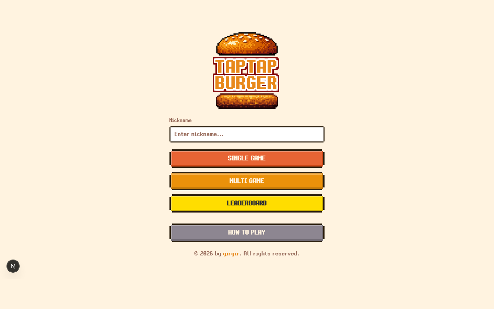
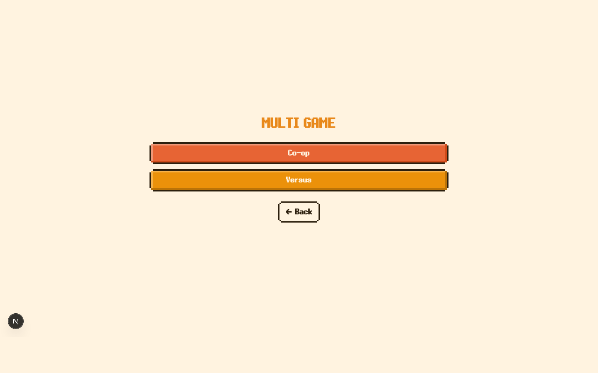
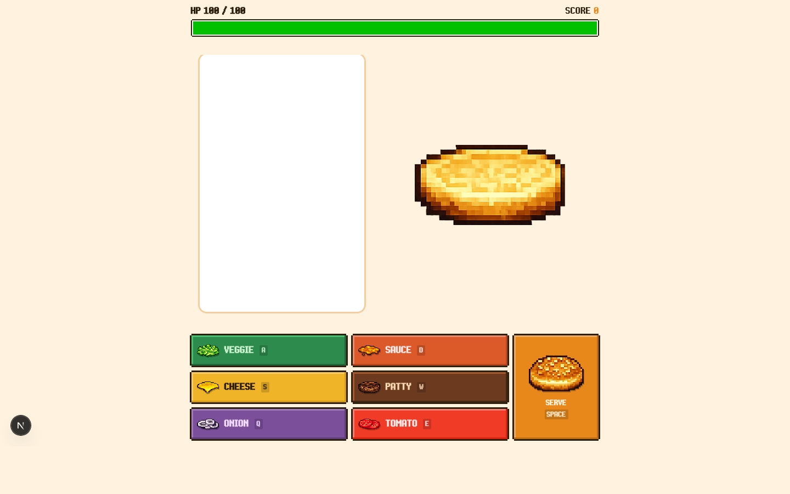
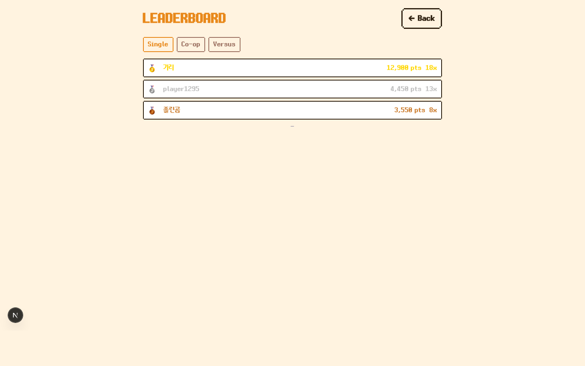
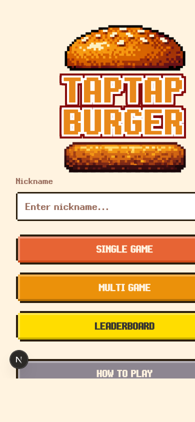
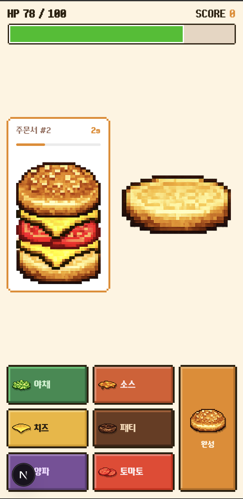

# Tab Tab Burger

주문서 순서대로 재료를 빠르게 쌓아 버거를 완성하는 웹 기반 리듬/캐주얼 아케이드 게임입니다.  
싱글, 협력(Co-op), 대전(Versus) 모드를 지원하며, Supabase 기반 리더보드와 실시간 멀티플레이를 제공합니다.

## 프로젝트 개요

- 프로젝트명: **Tab Tab Burger: Perfect Order**
- 장르: 리듬 / 캐주얼 아케이드
- 플랫폼: 웹 (모바일 우선 반응형 + 데스크톱 지원)
- 핵심 가치:
  - 짧은 세션에서도 즉시 재미를 주는 입력-판정 루프
  - 협력/대전 모드로 소셜 플레이 확장
  - 최고 점수 중심 리더보드 경쟁

## 게임의 목적

- 주문서의 **정확한 재료 순서**를 입력해 버거를 완성하고 제출합니다.
- HP가 시간에 따라 감소하므로, 정확도와 속도를 동시에 관리해야 합니다.
- 콤보와 피버를 활용해 더 높은 점수를 달성하고 모드별 리더보드 상위를 노립니다.

## 주요 포인트

- **멀티 모드 2종 지원**
  - Co-op: 두 플레이어가 키를 분담해 하나의 버거를 협력 제작
  - Versus: 실시간 상태 동기화 + 공격 메커닉으로 경쟁
- **피버 타임 시스템 (구현됨)**
  - 클리어 누적 기준 주기적으로 피버 주문 등장
  - 지정 재료를 6초간 최대한 쌓아 보너스 점수 획득
- **실시간 동기화**
  - Supabase Realtime broadcast/postgres_changes 기반 룸/상태 동기화
- **식별 및 기록 관리**
  - localStorage UUID 세션 기반 익명 플레이어 식별
  - `(player_id, mode)` 기준 최고 점수 업서트
- **언어 지원**
  - 한국어/영어 지원
  - 최초 접속 시 국가 코드(KR) 기반 locale 쿠키 설정

## 게임 기획 설계

### 핵심 플레이 루프

1. 주문 확인: 현재 주문(타깃 재료 순서)을 읽는다.
2. 입력/조합: 재료를 순서대로 쌓아 버거를 만든다.
3. 제출/판정: 정답/오답/시간초과를 판정한다.
4. 보상/리스크: 점수/콤보/HP를 갱신한다.
5. 난이도 전이: 주문 수 기반 난이도와 압박이 상승한다.

### 재미 설계 포인트

- **정확도 vs 속도의 동시 요구**
  - 정답만으로는 고점이 어렵고, 빠른 제출(콤보 조건)까지 맞춰야 한다.
- **단기 집중 세션**
  - HP 지속 감소 + 오답/타임아웃 패널티로 템포를 유지한다.
- **모드별 감정선 분리**
  - Single: 개인 기록 갱신
  - Co-op: 역할 분담과 커뮤니케이션
  - Versus: 상대 상태 관찰 + 공격/대응
- **피버 이벤트로 페이싱 조절**
  - 일정 클리어 주기마다 규칙을 전환해 단조로움을 줄인다.

## 프론트엔드 아키텍처

### 레이어 구조

- `src/app/*`: 라우팅 및 페이지 엔트리(App Router)
- `src/components/*`: UI/게임 프레젠테이션 컴포넌트
- `src/stores/*`: 전역 상태(Zustand, 게임/플레이어/룸)
- `src/hooks/*`: 입력/게임루프/리얼타임 구독 로직
- `src/lib/*`: 게임 규칙/상수/외부 I/O(Supabase) 유틸
- `src/styles/*`: SCSS 토큰/믹스인/컴포넌트 스타일

### 상태 관리 분리 전략

- `playerStore`: 세션 식별, 닉네임, 초기화
- `roomStore`: 멀티 로비/방 상태/준비 상태
- `gameStore`: 인게임 단일 소스 오브 트루스
  - 주문 큐, HP/점수/콤보, 피버 상태, 공격 수신 상태

### 렌더링/입력 처리 흐름

- 페이지 진입 후 카운트다운 → `startGame()`으로 게임 상태 시작
- `useGameLoop`가 주기적으로 `tick(delta)`를 호출해 시간 기반 상태 갱신
- `useKeyboard`/터치 입력이 `addIngredient`, `submitBurger` 등 액션을 호출
- 컴포넌트는 store 상태를 구독해 UI만 반영 (규칙 로직은 store/lib에 집중)

## 시스템 설계

### 데이터/식별 설계

- `localStorage`의 `ttb_session_id(UUID)`로 익명 사용자 식별
- `players.session_id` UNIQUE로 플레이어 중복 방지
- `scores(player_id, mode)` UNIQUE + RPC 업서트로 모드별 최고 기록 유지

### 실시간 멀티플레이 설계

- 대기실: `postgres_changes`로 `room_players`, `rooms.status` 동기화
- 게임 중(Co-op/Versus): Realtime `broadcast` 이벤트 중심 동기화
  - Co-op: 입력 액션 전파
  - Versus: 상태 업데이트, 공격, 피버 결과 전파
- 링크 기반 룸 참여: `waiting -> playing -> finished` 상태 전이

### 장애/엣지 케이스 대응

- Supabase 실패 시 플레이어 초기화는 로컬 세션으로 폴백
- 탭 종료/이탈 시 `keepalive` 요청으로 룸 `finished` 처리 시도
- 만료/종료 룸 진입 차단 및 만료 화면 분기
- 대기실에서 실시간 누락 대비 상태 폴링 보조

## 현재 구현 스펙 (Code Truth 기준)

PRD(`TapTapBurger_PRD.md`)는 기획과 코드 스펙을 함께 관리하며, 수치/룰 충돌 시 Current Spec을 우선합니다.

### 코어 룰

- HP: 최대 100, 시작 100
- HP 변화:
  - 정답 제출 +15
  - 콤보 제출 +20
  - 오답 제출 -10
  - 일반 주문 시간 초과 -20
- 콤보 조건: `elapsed < timeLimit * 0.65`
- 점수: 기본 100점 + 콤보 배율
  - 1~2: x1.5
  - 3~5: x2.0
  - 6~9: x3.0
  - 10+: x5.0

### 입력

- 키보드: `W/A/S/D + Q/E + Esc/Backspace + Enter/Space`
- 재료: patty, cheese, veggie, sauce, onion, tomato
- 모바일: 동일 기능 터치 버튼 제공

### 모드별 특징

- Single: 개인 점수 경쟁
- Co-op:
  - 재료 6종을 두 플레이어에게 3개씩 분배
  - `submit`은 양쪽 공통 제공
- Versus:
  - 상대 HUD(HP/점수/콤보/현재 타깃) 실시간 표시
  - 공격은 상대 큐 마지막 일반 주문에 재료/시간을 가산하는 방식

### 피버 시스템

- 기본 주문 5회 클리어마다 피버 주문 대기
- 피버 주문:
  - 제한 시간 6초
  - 지정 재료만 입력 가능
  - 성공 점수: `적재 개수 * 50`
  - 피버 종료 후 일반 루프로 복귀

## 기술 스펙

### 프론트엔드

- Next.js `16.1.6` (App Router)
- React `19.2.3`
- TypeScript
- SCSS (`sass`)
- Zustand (상태 관리)
- Framer Motion (일부 애니메이션)

### 백엔드/실시간

- Supabase (`@supabase/supabase-js`)
- PostgreSQL + RPC(`upsert_best_score`)
- Realtime 채널
  - 룸 대기실/상태 변경
  - Co-op 입력 브로드캐스트
  - Versus 상태/공격/피버 결과 동기화

### 데이터 모델 (핵심)

- `players`: session_id 기반 플레이어
- `scores`: 모드별 최고 점수/최대 콤보
- `rooms`: coop/versus 룸 상태
- `room_players`: 룸 참가자, ready, coop 할당 키

## 주요 페이지

- `/` 메인 (닉네임, 모드 선택, 리더보드, 게임 방법)
- `/game/single` 싱글 게임
- `/game/multi` 멀티 허브/로비
- `/game/coop/[roomId]` 협력 모드
- `/game/versus/[roomId]` 대전 모드
- `/leaderboard` 모드별 순위표

## 화면 캡처 (자동화)

아래 이미지는 자동 캡처 스크립트(`scripts/capture-screenshots.sh`)로 생성했습니다.

### 메인 화면



- 게임 진입의 허브 화면
- 닉네임 입력, 싱글/멀티/리더보드/게임 방법 CTA 제공
- 프로젝트의 픽셀 UI 톤과 브랜딩을 가장 먼저 전달

### 멀티 허브 화면



- 협력/대전 모드 선택 시작점
- 방 생성 후 링크 공유, 준비 상태 동기화 플로우의 시작 단계

### 싱글 인게임 화면



- 상단 HUD(HP, 점수) + 중앙 버거 스택 + 하단 입력 패널 구조
- 실시간 판정/콤보/피버 피드백이 겹쳐 보이는 핵심 플레이 UI
- 게임 기획의 코어 루프(입력-판정-보상)를 시각적으로 확인 가능

### 리더보드 화면



- 모드 탭(싱글/협력/대전) 기반 기록 탐색
- 점수 경쟁과 재방문 동기를 담당하는 메타 시스템 UI

### 모바일 대응 화면




- 모바일 우선 레이아웃으로 핵심 인터랙션을 유지
- 터치 입력 중심 UX에서도 데스크톱과 동일한 게임 루프 제공

## 실행 방법

### 1) 의존성 설치

```bash
npm install
```

### 2) 환경 변수 설정

`.env.local`에 아래 값을 설정합니다.

```env
NEXT_PUBLIC_SUPABASE_URL=...
NEXT_PUBLIC_SUPABASE_ANON_KEY=...
```

### 3) 개발 서버 실행

```bash
npm run dev
```

브라우저에서 `http://localhost:3000` 접속

## 스크립트

- `npm run dev`: 개발 서버
- `npm run build`: 프로덕션 빌드
- `npm run start`: 프로덕션 실행
- `npm run lint`: ESLint 검사
- `npm run capture:screens`: 주요 페이지 자동 캡처 (`docs/screenshots/*`)

## 문서

- PRD: `TapTapBurger_PRD.md`
  - 기획 의도 + 현재 코드 스펙 + Fever 스펙(v1) 포함
- DB 마이그레이션: `supabase/migrations/001_init.sql`
